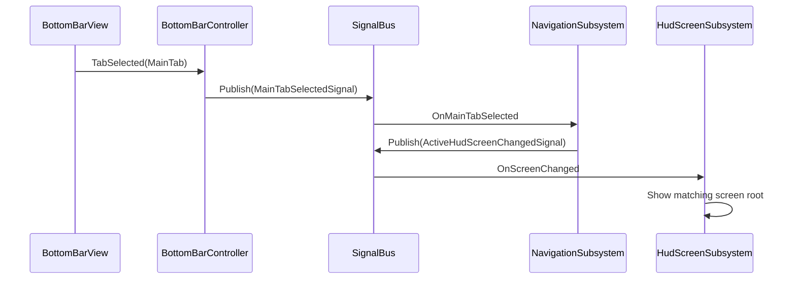
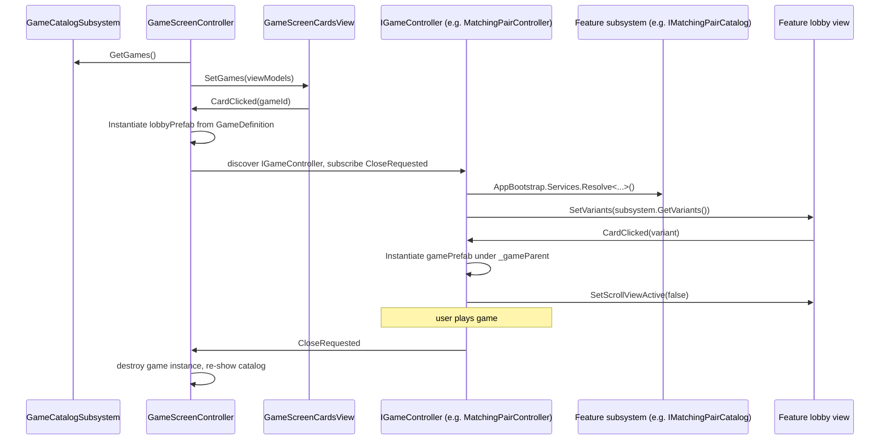

# Puzzle App — Architecture

Lightweight in-project framework: **composition root**, **custom DI**, **typed signal bus**, **subsystems**, **feature modules**, **ScriptableObject-driven data**. No third-party DI or message-bus packages.

---

## 1. Layer map

| Layer | Responsibility | Location |
|--------|----------------|----------|
| **Bootstrap** | Single startup: build container, run modules, hold `AppConfig` | `Assets/Core/Scripts/App/Bootstrap/` |
| **DI** | Register and resolve singletons | `Assets/Core/Scripts/App/DI/` |
| **Signals** | Cross-feature events (readonly structs) | `Assets/Core/Scripts/App/Signals/` |
| **Subsystems** | App-wide facades (navigation, HUD, lobby) | `Assets/Core/Scripts/App/Subsystems/` |
| **Services** | Cross-cutting infra (data providers) | `Assets/Core/Scripts/App/Services/` |
| **Controllers (app)** | Bridge MonoBehaviour views ↔ bus / services | `Assets/Core/Scripts/App/Controllers/` |
| **Modules** | Feature registration + init order | `Assets/Core/Scripts/App/Modules/`, `Assets/Core/Scripts/Features/*/`, per-game folders |
| **Views** | UI only; no business rules | `Assets/Core/Scripts/UI/` |
| **Core features** | Shell, catalog, lobby, home, shop | `Assets/Core/Scripts/Features/*/` |
| **Game features** | Per-game definition, catalog, module, game scripts | `Assets/<GameName>/Scripts/` (e.g. `Matching Pair/`, `Match Objects/`) |

---

## 2. Data assets (ScriptableObjects)

Gameplay data is edited as assets, not inline serialized fields.

| Asset | Role |
|-------|------|
| **`AppConfig`** | Single bundle holding every feature's config. One slot on `AppBootstrap`. |
| **`GameCatalogConfig`** | List of `GameDefinition[]` shown on the main catalog grid. |
| **`GameDefinition`** | `gameId`, `title`, `icon`, `catalogCardPrefab`, `lobbyPrefab`. |
| **`MatchingPairCatalogConfig`** | List of `MatchingPairDefinition[]` (one per piece-count variant). |
| **`MatchingPairDefinition`** | `pieceCount`, `title`, `icon`, `cardPrefab`, `gamePrefab`. |
| **`MatchObjectsDefinition`** | `id`, `title`, `icon`, `cardPrefab`, `pairs[]` (clue/answer sprite pairs). |

**Rule:** data flows *config asset → DI → subsystem/controller → view*. Views never own business data.

---

## 3. Startup sequence

1. **`AppBootstrap.Awake`** (`[DefaultExecutionOrder(-1000)]`).
2. All view references and the single **`AppConfig`** are **`[SerializeField]`** — assigned in the inspector, no runtime search.
3. Create **`ServiceRegistry`**. Register infrastructure (`ISignalBus`, `IGameDataProvider`) and each sub-config pulled from **`AppConfig`** (`GameCatalogConfig`, `MatchingPairCatalogConfig`, …).
4. Instantiate module list (see §7). For each **`IAppModule`**: call **`Register(services)`**.
5. After all modules registered: call **`Initialize(services)`** on each (warm up singletons, wire HUD).
6. Publish **`AppBootstrap.Services`** as a static accessor so MonoBehaviours instantiated later (e.g. a game prefab's controller) can resolve services without constructor injection.

---

## 4. Dependency injection (`ServiceRegistry`)

- **`RegisterInstance<T>(T instance)`** — already constructed.
- **`RegisterSingleton<T>(Func<IServiceRegistry, T> factory)`** — lazy, one instance.
- **`Resolve<T>()`** / **`TryResolve<T>()`**.

MonoBehaviours are **not** auto-injected. Two patterns:

- **Serialized:** `AppBootstrap` holds `[SerializeField]` references and passes them into module constructors.
- **Service locator:** runtime-instantiated MonoBehaviours (game lobby prefabs, game boards) call `AppBootstrap.Services?.Resolve<T>()` in `Awake`.

---

## 5. Signal bus

- **`ISignalBus.Subscribe<TSignal>(Action<TSignal>)`** → returns **`IDisposable`**.
- **`ISignalBus.Publish<TSignal>(TSignal)`**.

| Signal | Meaning |
|--------|---------|
| `MainTabSelectedSignal` | Bottom bar chose Home / Game / Shop |
| `ActiveHudScreenChangedSignal` | HUD should show the screen for that tab |
| `GameCardSelectedSignal` | User tapped a game card (by **game id**) |
| `LobbyClosedSignal` | User left a game lobby (back button) |

---

## 6. Subsystems and services

| Interface | Role |
|-----------|------|
| **`INavigationSubsystem`** | Current tab; reacts to `MainTabSelectedSignal`; publishes `ActiveHudScreenChangedSignal` |
| **`IHudScreenSubsystem`** | Registers `GameObject` roots per tab; shows/hides on `ActiveHudScreenChangedSignal`; `HideAll()` for lobby overlay |
| **`IGameCatalogSubsystem`** | Returns catalog data (`IReadOnlyList<GameDefinition>`, `IReadOnlyList<GameCardViewModel>`) from `GameCatalogConfig` |
| **`ILobbySubsystem`** | Maps `gameId → lobby root`; reacts to `GameCardSelectedSignal` / `LobbyClosedSignal`; toggles lobby vs HUD |
| **`IMatchingPairCatalog`** | `GetVariants()` and `TryGetVariant(pieceCount, out def)` — built from `MatchingPairCatalogConfig` |
| **`IMatchObjectsDataService`** | Loads `match_objects_data.json` via `IGameDataProvider`; picks rounds and maps pair indices → sprites |
| **`IGameDataProvider`** | Abstracts JSON/text loading. Default impl `ResourcesGameDataProvider` uses `Resources.Load<TextAsset>`. |
| **`IGameController`** (interface only) | Implemented by each game's root MonoBehaviour on its `lobbyPrefab`. `GameScreenController` discovers it and subscribes to `CloseRequested`. |

---

## 7. Feature modules

Each module implements **`IAppModule`**:

- **`Register(IServiceRegistry)`** — bind services and subsystems.
- **`Initialize(IServiceRegistry)`** — resolve side effects (wire HUD, warm singletons, republish nav state).

| Module | Location | Registers |
|--------|----------|-----------|
| **`ShellModule`** | Core | `NavigationSubsystem`, `HudScreenSubsystem`, `BottomBarController` |
| **`LobbyModule`** | Core | `LobbySubsystem` |
| **`HomeScreenModule`** | Core | Home HUD screen registration |
| **`GameCatalogModule`** | Core | `GameCatalogSubsystem` built from `GameCatalogConfig`; initializes `GameScreenController` |
| **`ShopScreenModule`** | Core | Shop HUD screen registration |
| **`MatchingPairModule`** | Game feature | `IMatchingPairCatalog` built from `MatchingPairCatalogConfig` |
| **`MatchObjectsModule`** | Game feature | `IMatchObjectsDataService` (uses `IGameDataProvider`) |

**Instantiation order in `AppBootstrap`:** `Shell → Lobby → HomeScreen → GameCatalog → ShopScreen → MatchingPair → MatchObjects`.

---

## 8. Card/view inheritance

All lobby card items extend a generic base to share button wiring and icon binding:

```
MonoBehaviour
  └─ CardItemBase<TData>            // [SerializeField] Button _button, Image _iconImage; Bind(TData), abstract ApplyBinding(TData), abstract OnClicked(TData)
      ├─ GameCardItem               // TData = GameCardViewModel (main catalog)
      ├─ MatchingPairCardItem       // TData = MatchingPairDefinition (lobby grid)
      └─ MatchObjectsCardItem       // TData = MatchObjectsDefinition (category grid)
```

All game lobby views extend a base:

```
MonoBehaviour
  └─ GameLobbyView                  // Play + Back buttons, events
      ├─ MatchingPairLobbyView      // scroll grid of piece-count cards
      └─ MatchObjectsLobbyView      // scroll grid of category cards
```

---

## 9. Runtime flow — tab switching



---

## 10. Runtime flow — catalog → game lobby → game



---

## 11. View rules

- Views (`BottomBarView`, `GameScreenCardsView`, card items, `GameLobbyView` subclasses): events, layout, prefab spawning only. **No business data fields.**
- Controllers subscribe to views, resolve services/subsystems, and push data into views via explicit methods (e.g. `SetVariants(...)`, `SetGames(...)`).
- Subsystems own cross-feature state and policies.
- Game-specific data lives in ScriptableObject assets wired through `AppConfig`, not on view prefabs.

---

## 12. Adding a new game

1. Create game scripts folder `Assets/<GameName>/Scripts/` and prefabs folder.
2. **Definition SO** — `XDefinition : ScriptableObject` with game data + `cardPrefab` + `gamePrefab`. Create one `.asset` per variant/category.
3. **Catalog config SO** — `XCatalogConfig : ScriptableObject` holding `XDefinition[]`. Create one `.asset`.
4. **Catalog subsystem** — `IXCatalog` + impl, built from the config. Provides lookup by key.
5. **Module** — `XModule : IAppModule` registering the subsystem from the config.
6. **Controller** — `XController : MonoBehaviour, IGameController` on the `lobbyPrefab` root. In `Awake`: resolve `IXCatalog` via `AppBootstrap.Services`, call `view.SetVariants(...)`, subscribe card clicks.
7. **Lobby view** — `XLobbyView : GameLobbyView` (pure view): `SetVariants(IReadOnlyList<...>)` spawns card items, forwards clicks.
8. **Card item** — `XCardItem : CardItemBase<XDefinition>`.
9. **Game prefab** — the actual game UI + `XBoardView` (or game controller) with `GameWon` event.
10. **Wire into app:** add field to `AppConfig`, register instance in `AppBootstrap.Bootstrap()`, add new module to the module array.
11. **Expose in main catalog:** add a new `GameDefinition.asset` (pointing `lobbyPrefab` at the lobby prefab) and include it in `GameCatalogConfig.games[]`.

---

## 13. Extension checklist

- [x] Main catalog data lives on a `GameCatalogConfig` SO (not on the view).
- [x] Single `AppConfig` bundle on `AppBootstrap` replaces per-feature serialized slots.
- [x] Per-game catalogs follow the same pattern: definition SO + config SO + module + subsystem.
- [x] `CardItemBase<TData>` generic base for lobby card items.
- [x] `IGameDataProvider` abstracts Resources-based JSON loading.
- [x] `MatchingPair` feature migrated to SO-driven catalog.
- [x] `MatchObjects` feature added (JSON-driven rounds + drag-and-drop gameplay).
- [ ] `MatchObjectsLobbyView` still holds `MatchObjectsDefinition[]` inline — migrate to SO catalog for parity.
- [ ] Wire **Play** callback via `GameLobbyController(view, bus, onPlay)` for games that use the explicit Play button.
- [ ] Add remaining games (WaterSort, etc.) via the §12 recipe.

---

## 14. Key files

| File | Purpose |
|------|---------|
| `Assets/Core/Scripts/App/Bootstrap/AppBootstrap.cs` | Composition root; static `Services` accessor |
| `Assets/Core/Scripts/App/Bootstrap/AppConfig.cs` | SO bundle of all feature configs |
| `Assets/Core/Scripts/App/DI/ServiceRegistry.cs` | DI container |
| `Assets/Core/Scripts/App/Signals/SignalBus.cs` | Signal bus |
| `Assets/Core/Scripts/App/Signals/AppSignals.cs` | Signal payload types |
| `Assets/Core/Scripts/App/Services/IGameDataProvider.cs` | JSON/text loading abstraction |
| `Assets/Core/Scripts/App/Services/ResourcesGameDataProvider.cs` | Resources-based impl |
| `Assets/Core/Scripts/App/Subsystems/LobbySubsystem.cs` | Lobby routing subsystem |
| `Assets/Core/Scripts/App/Subsystems/HudScreenSubsystem.cs` | HUD screen visibility |
| `Assets/Core/Scripts/App/Subsystems/NavigationSubsystem.cs` | Tab/navigation state |
| `Assets/Core/Scripts/Features/GameCatalog/GameDefinition.cs` | Catalog entry SO |
| `Assets/Core/Scripts/Features/GameCatalog/GameCatalogConfig.cs` | Catalog list SO |
| `Assets/Core/Scripts/Features/GameCatalog/GameCatalogSubsystem.cs` | Catalog lookup |
| `Assets/Core/Scripts/Features/GameCatalog/GameScreenController.cs` | Instantiates lobby prefabs; discovers `IGameController` |
| `Assets/Core/Scripts/Features/GameCatalog/IGameController.cs` | Game-side contract for catalog integration |
| `Assets/Core/Scripts/UI/CardItemBase.cs` | Generic card base |
| `Assets/Core/Scripts/UI/GameLobbyView.cs` | Base lobby view |
| `Assets/Core/Scripts/UI/GameScreenCardsView.cs` | Pure catalog grid view |
| `Assets/Matching Pair/Scripts/MatchingPairDefinition.cs` | Piece-count variant SO |
| `Assets/Matching Pair/Scripts/MatchingPairCatalogConfig.cs` | Variant list SO |
| `Assets/Matching Pair/Scripts/MatchingPairCatalog.cs` | `IMatchingPairCatalog` impl |
| `Assets/Matching Pair/Scripts/MatchingPairModule.cs` | Feature module |
| `Assets/Matching Pair/Scripts/MatchingPairBoardView.cs` | Gameplay board |
| `Assets/Core/Scripts/UI/MatchingPairController.cs` | Lobby → game controller, `IGameController` |
| `Assets/Core/Scripts/UI/MatchingPairLobbyView.cs` | Pure variant grid view |
| `Assets/Match Objects/Script/MatchObjectsDefinition.cs` | Category SO (clue/answer pairs) |
| `Assets/Match Objects/Script/MatchObjectsDataService.cs` | JSON-driven round/pair selection |
| `Assets/Match Objects/Script/MatchObjectsModule.cs` | Feature module |
| `Assets/Match Objects/Script/MatchObjectsBoardView.cs` | Drag-to-match game board |
| `Assets/Match Objects/Script/MatchObjectsDraggableItem.cs` | Bottom-bar draggable |
| `Assets/Match Objects/Script/MatchObjectsDropZone.cs` | Right-column drop target |
| `Assets/Match Objects/Script/MatchObjectsClueItem.cs` | Left-column static clue |
| `Assets/Core/Scripts/UI/MatchObjectsController.cs` | Lobby → game controller, `IGameController` |
| `Assets/Core/Scripts/UI/MatchObjectsLobbyView.cs` | Category grid view |
| `Assets/Resources/match_objects_data.json` | Match Objects round/pair indices |
