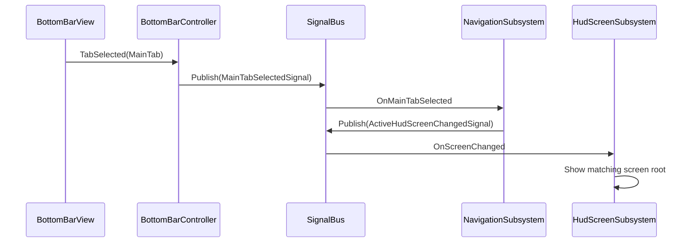
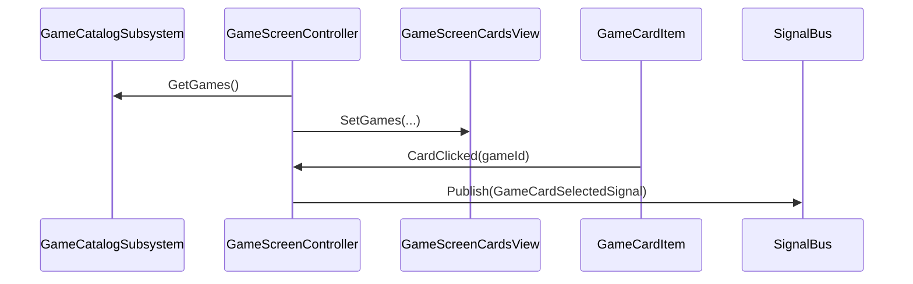
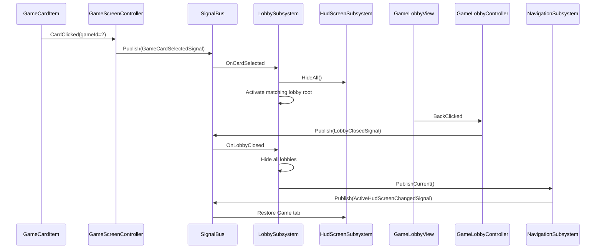

# Puzzle App — Architecture

Lightweight in-project framework: **composition root**, **custom DI**, **typed signal bus**, **subsystems**, **feature modules**. No third-party DI or message-bus packages.

---

## 1. Layer map

| Layer | Responsibility | Location (example) |
|--------|----------------|---------------------|
| **Bootstrap** | Single startup: build container, run modules | `Assets/Scripts/App/Bootstrap/` |
| **DI** | Register and resolve singletons | `Assets/Scripts/App/DI/` |
| **Signals** | Cross-feature events (structs) | `Assets/Scripts/App/Signals/` |
| **Subsystems** | App-wide facades (navigation, HUD) | `Assets/Scripts/App/Subsystems/` |
| **Controllers** | Bridge MonoBehaviour views ↔ bus / services | `Assets/Scripts/App/Controllers/` |
| **Modules** | Feature registration + init order | `Assets/Scripts/App/Modules/`, `Assets/Scripts/Features/*/` |
| **Views** | UI only; no business rules | `Assets/Scripts/UI/` |

---

## 2. Startup sequence

1. **`AppBootstrap.Awake`** (on `UILayer_HUD` root, early execution order).
2. All view references are **`[SerializeField]`** — assigned in the inspector, no runtime search.
3. Lobby entries use a **`LobbyEntry[]`** array: add a game lobby by adding an inspector entry (zero code changes).
4. Create **`ServiceRegistry`**, register **`ISignalBus`** instance.
5. For each **`IAppModule`**: **`Register(services)`** then **`Initialize(services)`**.
6. Order today: **`ShellModule`** → **`GameCatalogModule`** → **`LobbyModule`**.

---

## 3. Dependency injection (`ServiceRegistry`)

- **`RegisterInstance<T>(T instance)`** — already constructed.
- **`RegisterSingleton<T>(Func<IServiceRegistry, T> factory)`** — lazy, one instance.
- **`Resolve<T>()`** / **`TryResolve<T>()`**.

MonoBehaviours are **not** auto-injected; they are assigned via `[SerializeField]` on `AppBootstrap` and passed into modules/controllers.

---

## 4. Signal bus

- **`ISignalBus.Subscribe<TSignal>(Action<TSignal>)`** → returns **`IDisposable`**.
- **`ISignalBus.Publish<TSignal>(TSignal)`**.

### Signals (initial set)

| Signal | Meaning |
|--------|---------|
| `MainTabSelectedSignal` | Bottom bar chose Home / Game / Shop |
| `ActiveHudScreenChangedSignal` | HUD should show the screen for that tab |
| `GameCardSelectedSignal` | User tapped a game card (by **game id**) |
| `LobbyClosedSignal` | User left a game lobby (back button) |

---

## 5. Subsystems

| Interface | Role |
|-----------|------|
| **`INavigationSubsystem`** | Current tab; reacts to `MainTabSelectedSignal`; publishes `ActiveHudScreenChangedSignal` |
| **`IHudScreenSubsystem`** | Registers `GameObject` roots per tab; shows/hides on `ActiveHudScreenChangedSignal`; `HideAll()` for lobby overlay |
| **`IGameCatalogSubsystem`** | Returns catalog data (`GameCardViewModel` list) |
| **`ILobbySubsystem`** | Maps `gameId -> lobby root`; reacts to `GameCardSelectedSignal` / `LobbyClosedSignal`; toggles lobby vs HUD |

---

## 6. Feature modules

Each module implements **`IAppModule`**:

- **`Register(IServiceRegistry)`** — bind services and controllers.
- **`Initialize(IServiceRegistry)`** — resolve side effects (wire HUD, refresh nav).

| Module | Registers | Notes |
|--------|-----------|--------|
| **`ShellModule`** | `NavigationSubsystem`, `HudScreenSubsystem`, `BottomBarController` | `BottomBarController` publishes tab signals |
| **`GameCatalogModule`** | `GameCatalogSubsystem`, `GameScreenController` | Registers **Game** HUD root; republishes current tab after registration |
| **`LobbyModule`** | `LobbySubsystem`, `GameLobbyController` per entry | Data-driven via `LobbyEntry[]`; adding a game = adding an inspector entry |

---

## 7. Runtime flow (tabs)

---

## 8. Runtime flow (game cards)

---

## 9. Runtime flow (lobby navigation)

---

## 10. View rules

- **`BottomBarView`**, **`GameScreenCardsView`**, **`GameCardItem`**, **`GameLobbyView`** (and subclasses): events and layout only.
- **Controllers** subscribe to views and publish/consume signals.
- **Subsystems** own cross-feature state and policies.

---

## 11. Extension checklist

- [ ] Add **Home** / **Shop** screens: new prefabs + register in **`IHudScreenSubsystem`** from new modules.
- [x] Subscribe to **`GameCardSelectedSignal`** in **`LobbySubsystem`** to open game lobbies.
- [ ] Add lobby prefabs for remaining games (Jigsaw, Find It) — add `LobbyEntry` in inspector.
- [ ] Wire **Play** callback via `GameLobbyController(view, bus, onPlay)` to load gameplay scenes.
- [ ] Replace static **`GameCatalogSubsystem`** data with ScriptableObjects or remote config.
- [x] Replace `FindObjectOfType` in **`AppBootstrap`** with `[SerializeField]` references.

---

## 12. Key files

| File | Purpose |
|------|---------|
| `Assets/Scripts/App/Bootstrap/AppBootstrap.cs` | Composition root (serialized refs) |
| `Assets/Scripts/App/DI/ServiceRegistry.cs` | DI container |
| `Assets/Scripts/App/Signals/SignalBus.cs` | Signal bus |
| `Assets/Scripts/App/Signals/AppSignals.cs` | Signal payload types |
| `Assets/Scripts/App/Subsystems/LobbySubsystem.cs` | Lobby routing subsystem |
| `Assets/Scripts/UI/GameLobbyView.cs` | Base lobby view (Play / Back) |
| `Assets/Scripts/Features/Shell/ShellModule.cs` | Shell feature |
| `Assets/Scripts/Features/GameCatalog/*` | Game list feature |
| `Assets/Scripts/Features/Lobby/LobbyModule.cs` | Lobby feature module (data-driven) |
| `Assets/Scripts/Features/Lobby/LobbyEntry.cs` | Serializable gameId-to-view mapping |
| `Assets/Scripts/Features/Lobby/GameLobbyController.cs` | Generic lobby controller |
| `Assets/Prefabs/UILayer_HUD.prefab` | Hosts `AppBootstrap` |
